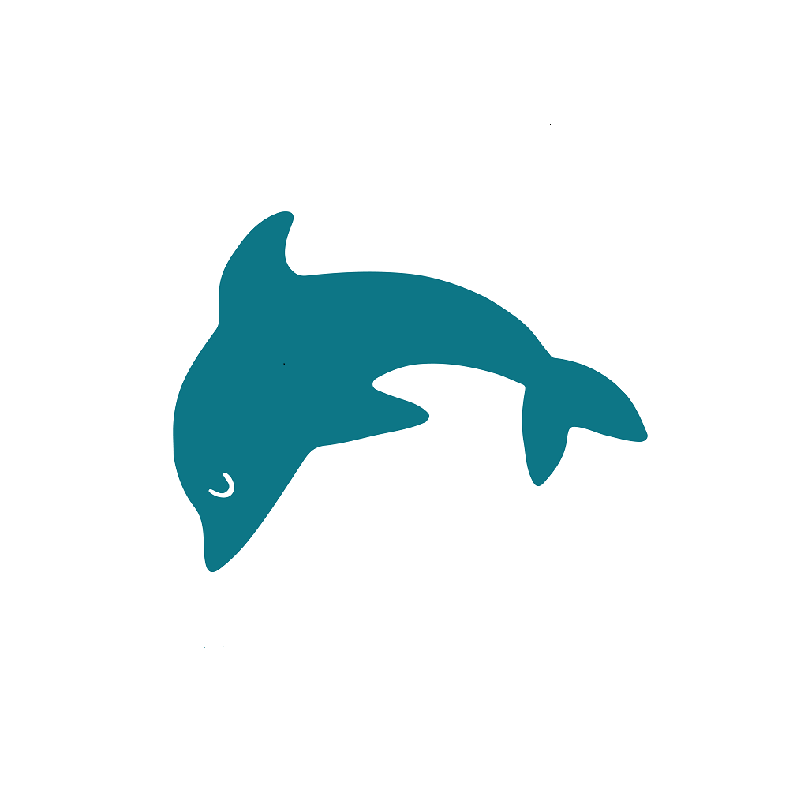

<p align="center">
  <a href="https://upself.id">
    
    <h1 align="center">Upself</h1>
  </a>
</p>

<p align="center" style="font-weight:bold">Upself Indonesia</p>

## Getting Started

This README page demonstrates how to install and run this app. Visit [Upself](https://upself.id) for more information.

## Pre-Requisites

- NPM from [Node.js website](https://nodejs.org/en/).
- Yarn using `npm -g yarn` on the CLI.
- Expo Client from [Google Play](https://play.google.com/store/apps/details?id=host.exp.exponent&hl=in&gl=US) or [App Store](https://apps.apple.com/us/app/expo-client/id982107779).

## Installation

```
# Download the repo
git clone https://github.com/Upself-ID/upself-mobile.git

# Move to the project directory and open it using a code editor
cd ./Upself

# Install NPM dependencies
npm install

# Install Yarn dependencies
yarn install
```

## Starting Development Mode

```
# Start development mode
expo start
```

## Running the App in Development Mode

1. Run `expo start` on CLI.
2. It will create a localhost.
3. Wait until a QR code shows up on the CLI and the localhost.
4. Open the Expo app on the phone and scan the QR code using the app.
5. Wait until the build finishes.
6. You can now use the app on development mode.
